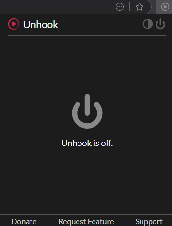
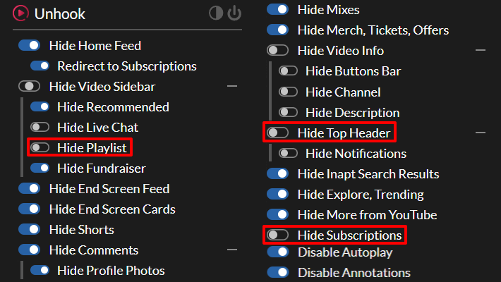
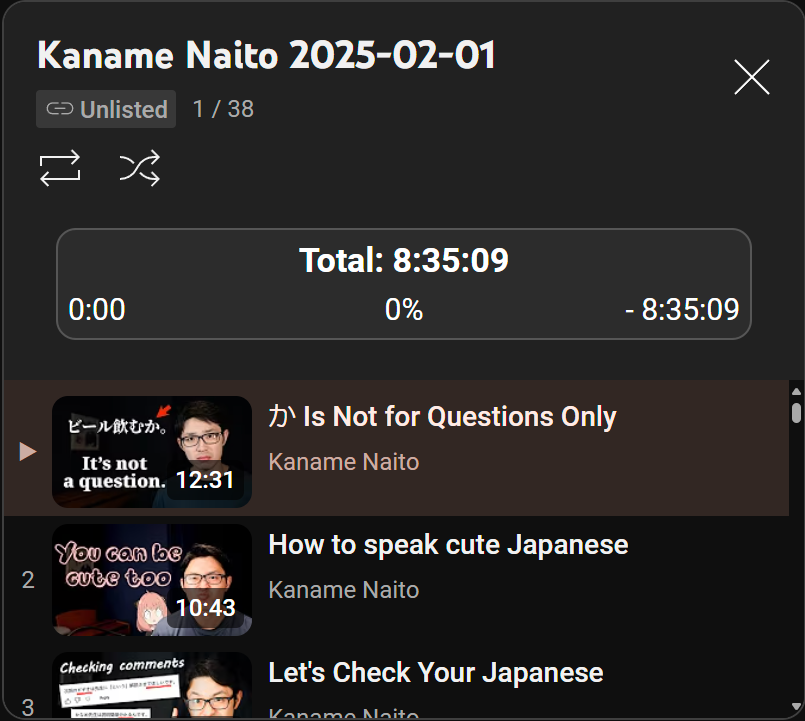
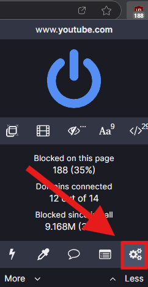
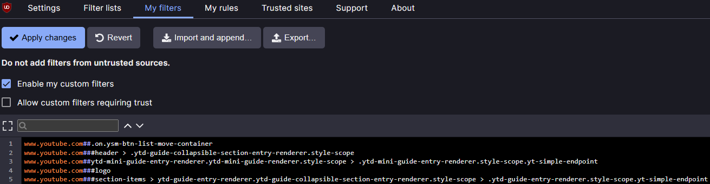
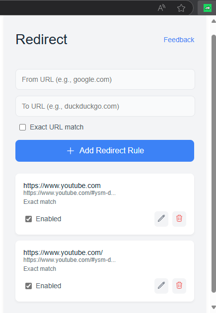
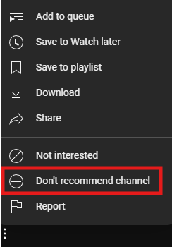

## Why Use YouTube for Sentence Mining?

This is a step-by-step guide on how to set up YouTube for the best sentence mining experience. It won't go into detail about why YouTube is arguably the best platform, as many other resources explain its advantages over other media. However, I believe you should stay connected to whatever initially sparked your language learning journey.

For example, if you are studying Japanese with the sole purpose of watching anime without subtiles, then you should mine with it and use an anime frequency list to find relevant vocabulary. If, however, you wanted to learn it because you are interested in being able to understand and converse in your target language, then YouTube is most definitely the best option.

## Setting Up for Success

### Designate a Specific Account for Each Language

You don't want to mix the YouTube account that you use for regular entertainment with the one you'll use for sentence mining; it just makes it harder to fully commit to one or the other. Therefore, as a first step, I recommend assigning or creating a YouTube account solely for consuming content in your target language. It's okay if you've already watched other type of videos on that account as the important thing is that you only have subscriptions to channels in the language you're studying. 

### Find Content You Care About

If you're a beginner, then you probably feel overwhelmed with more advanced content and would like to watch some easier videos to act as a bridge into intermediate ones. If you are more advanced, I'd say 2,000+ words, then you'll probably find most of the beginner friendly" content dull and mining sentences will be a bit harder. At this stage, stop for a moment to consider what kind of stuff you're actually interested in watching. 

You dream about visiting a country that speaks the language? Then look for its popular domestic travel channels. You can do this by searching videos for it in YouTube itself, but I advise straight up asking other people for recommendations or searching for forum posts asking for the same kind of channels. It is extremely important that whatever you're watching resonates with you.  

### Make Your Computer "Study Only"

After following these steps I also recommend taking the opportunity to clear YouTube as a source of distraction in your computer and using it for regular entertainment only in the living room TV or somewhere else to make a strong mental connection between using the site on a pc and studying a language. 

It's obviously okay to also use you computer for other types of studies, just make sure that it's straight-up academic content and not edutainment (which should be relatively easy, given all the ways we've transformed the platform here). Sure, you learn a thing or two with them, but it still is a leisure activity, so leave it for your entertainment device of choice.

## Essential Tools to Enhance Your Experience

### Unhook: Eliminate Distractions

When browsing through YouTube, a lot of people get the feeling that they are just wasting their time watching videos that they aren't even interested in. It’s normal to feel bad and blame your lack of discipline or self-control, but you might not realize how much the site bombards you with distractions until you remove them. You'll be surprised how different the YouTube experience is without all of those intrusive distractions, with only your carefully selected subscriptions and the search bar to find videos that you actually want to watch.


Install Unhook


Clicking on the extension icon will show you the pop-up menu. If it appears like this, you need to turn it on by clicking on the big gray button:



These are my recommended settings, but you can adjust it to your liking:




Enabling	 the settings marked with __red rectangles__ is __not recommended__ and interferes with the next extension's functionality.


### PocketTube: Better Video Browsing

This is actually a set of two extensions that go hand in hand. These are the most feature-packed addons of the list and are the ones that inspired me to create it. Because of how much stuff they bring to elevate the experience, I made this video to show how you can use them to make finding videos for sentence mining way easier:


‎


If you delete a video from your history, its watch-progression is cleared, so __don't ever clear your entire watch history__, only one video at a time.


There is an official YouTube channel for the extensions, but I find their videos to be a bit all over the place. Still, if you are still interested in learning more about them (specially if you become a Patreon), I do recommend [checking it out](https://www.youtube.com/@PocketTubeHQ/videos).

Now that you know what they do and how they work, you can go and install them both:


Install PocketTube Subscriptions Manager

‎


Install PocketTube Playlist Manager


I should mention that it is a freemium extension and the version that you saw in the video is the paid one. The free version limits the deck to only one group column, one channel column, and doesn't allow for playlist columns. It also doesn't have the custom duration filter on playlists, but it does allow you to filter by predetermined ones (0-15, 15-60, 60+ minutes). 

It's not necessary at all to purchase the premium membership, as __the free version is already amazing__, but if you are absolutely serious about using YouTube as your main mining source, I absolutely recommend it. It is 3$ USD a month and you can explore its many benefits in the Patreon tab both on the Deck/Group feed and the PocketTube button in the _You_ section on the left (each one displaying benefits for their respective extension). The one that I absolutely adore is the full deck, as it lets me add multiple columns, including playlist ones. 

You can join the Patreon by going on [this link](https://www.patreon.com/c/ysub) and subscribing and you can activate it on the same Patreon tab where you can browse the benefits. I am in no way affiliated with PocketTube or its creators, I'm just a very happy customer that wants to share it with others. 

__If you subscribe to the premium version__, please watch this video I made on how to make the most out of the deck. __If not, please skip it.__


‎


You can move the _Subscription groups_ section up or down with the arrows below them, but you should keep it either at the top or below the _Deck_ button for _Unhook_ to work correctly. __If you move it down too much, the whole section will dissapear.__ Do not panic, just turn off _Unhook_, bring it back to the top and turn it on again.


#### No Playlist Autoplay for YouTube

PocketTube makes it easy to create playlists of unwatched videos, but there's a catch: it marks a video as "Watched" if it has been played, even for a second. Since YouTube auto-plays the next video in a playlist by default, with no official way of disabling it, which can lead to videos being marked as watched unintentionally. To prevent this, install this extension, which stops auto-play at the end of a video. You can manually play the next video by clicking on it, pressing the _NEXT_ button, or using the _(SHIFT + N)_ shortcut.


Install No Playlist Autoplay For YouTube


#### YouTube Playlist Duration Bar

Since playlists with only unwatched videos can now play a bigger part of the way in which we consume YouTube content, it would be very convenient to know exactly how much time a playlist would take to watch to completion (without pausing). This extension does exactly that and works like a charm!



There's just one limitation, and it is that, while YouTube allows playlists with up to 5,000 videos, it can only display a maximum of 200 videos at a time, so if your playlist is bigger than that this extension will only tell you the remaining time for the ones displayed. This isn't really a big deal, but I thought it could prevent confusion.


Install YouTube Playlist Duration Bar


### uBlockOrigin: Ads and Extra Elements Blocking

Almost everyone knows that adblockers block, well... ads, but not a lot of people know that some of them can also block specific elements in a page. I prefer uBlock Origin, as it offers this functionality and helps eliminate distracting clutter. 


Install uBlock Origin


Once you've installed it, click on the extension and then the gear icon in the menu:



The next page will open:



Now copy and paste this element list to it and click _Apply Changes_. A _Copy_ button will show up while hovering over the text to make it easier.


```html
www.youtube.com###logo
www.youtube.com##ytd-guide-entry-renderer.ytd-guide-section-renderer.style-scope:nth-of-type(1)
www.youtube.com##ytd-guide-entry-renderer.ytd-guide-collapsible-section-entry-renderer.style-scope:nth-of-type(2)
www.youtube.com##ytd-guide-entry-renderer.ytd-guide-collapsible-section-entry-renderer.style-scope:nth-of-type(3)
www.youtube.com##ytd-mini-guide-entry-renderer.ytd-mini-guide-renderer.style-scope:nth-of-type(1)
www.youtube.com##ytd-mini-guide-entry-renderer.ytd-mini-guide-renderer.style-scope:nth-of-type(4)
www.youtube.com##ytd-button-renderer.ytd-browse-feed-actions-renderer.style-scope > yt-button-shape
www.youtube.com###endpoint > .ytd-compact-link-renderer.style-scope
```

The differences are minimal, but you can notice them in the left sidebar and the page logo; now it only has the buttons you need. If you find another element that you want to block, you can use the __eyedropper tool__ to the left of the gear icon in the menu to pick one. If you mess up, you can always go back to the element list and delete the one you just added to the list.


Whenever you see an element you need being hidden, just disable the extension and reload the page to do the action and then re-enable it.


### Redirect: Start Mining on the Right Foot
	
This extension, as the name imples, redirects you to another link when you enter a website. We'll use this to optimize YouTube's default page for mining with interesting videos at your level.


Install Redirect


After installing it and clicking on the extension icon, this interface will pop up.



In _From URL_, paste this:

```html
https://www.youtube.com
```

In _To URL_, since the deck that comes with PocketTube's free tier is rather limiting, I recommend to input something different depending on if you're subscribed to the Patreon or not:

- You're a Patreon member:

  ```html
  https://www.youtube.com/#ysm-deck
  ```

- You're on the free version (You can only choose one of the following):

  - The subscription feed:
    ```html
    https://www.youtube.com/feed/subscriptions
    ```
  - Your favorite subscription group you've made. If it is "Vlog", for example, it would be:
    ```html
    https://www.youtube.com/feed/subscriptions#ysm-group-title=Vlog
    ```
  - A playlist you enjoy all or most of the videos in it. You can change the playlist once you've finished it. For example: 
    ```html
    https://www.youtube.com/playlist?list=PLUqu4MKiV5q_msliiqZJSEscdPuwUAWG2
    ```

Now, whenever you go to the YouTube home page you'll be greeted with only videos you want to see.

## Optimizing Your Workflow

### Finding New Content 

Now that the home page and recommended section are not part of your YouTube browsing routine, how will you find more channels? Well, there are two main ways:

1. Ask the community for recommendations (There are many great ones in the #media-recommendations channels in the Migaku Discord).  
2. Use YouTube's recommended section.

"Wait, but we just disabled the recommended sidebar with _Unhook_!" Yes, and for the most part, it should stay hidden. However, when actively searching for a new channel, it can be quite handy.

First, click on a video from a channel that you want to find similar content. Go to _Unhook_ and disable the "Hide Recommended" toggle, now you are able to see the recommended videos like normal.  

Whenever you find a video on a language that is not your target one or that you're simply not interested in, click on the three dots "⋮" in the upper right corner of the video box and click on "Don't recommend channel". There's also the "Not interested" button, but I find that the other option is more effective and immediate.



When you find a video that piques your interest, click on it and see if you're fond of its channel's content. If you do, then you can subscribe, add to a group and even create a channel playlist to add it to the deck. Don't forget to re-enable the "Hide Recommended" toggle on _Unhook_ once you've finished.

### Generate Subtitles with Migaku
  
As of the writing of this article, this feature is exclusive to Early Access and Lifetime users. 

The biggest drawback of mining on YouTube is that most channels don't add manual subtitles and the ones the platform generates aren't very good. Fortunately, Migaku has a feature 

Still, this system isn't perfect either and does make mistakes from time to time. You should always check the sentence you're mining to make sure that it has the intended meaning and, if needed, correct if before creating. Because of this, I still advise to try to mine with videos that have subtitles. 

Fortunately, while most don't add them as closed captions for YouTube, videos on certain languages, like Japanese, tend to display them on screen, so even though the generated ones may not be entirely accurate you can always compare with the intended writing. 



If the video has manually-created closed captions, don't generate subtitles as they will be less accurate.


### Don't Worry About Skipping Videos

There's one advantage of using YouTube over series, anime and manga that I haven't heard anyone mention before and that is that, for the most part, videos on the platform don't follow a strict linear narrative progression, so, unless you are watching something like a playthrough series, you don't have to worry at all about skipping a video if:

1. You're not feeling interested in it.
2. There aren't enough recommended sentences to reach your daily objective in the time you have.

There are occassions on which you just don't have a lot of time to mine sentences that day. It can feel really frustrating when you click on a 15 minute video and see that there are only 2 or 3 recommended sentences. When that happens, either add it to _Watch later_ if you really want to watch it when you have the time for it or just skip to the next video if you don't really care about it.

### Always Use Fullscreen

You can enter and exit fullscreen by pressing __F11__ in any browser. If you tend to wander around in your browser or other apps when you should be concentrating on the current video, this is a must. Very simple tip, but extremely effective.

## A New YouTube Experience

If you've followed the steps indicated in this article, then you'll notice just how much you've transformed the way you consume content on the platform. I truly hope this guide has made your sentence mining more enjoyable and streamlined.

# Happy immersing!